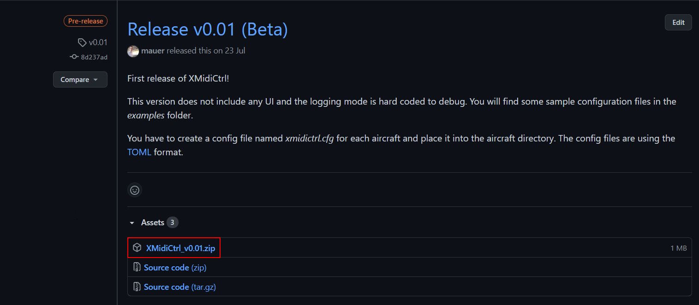

# Installation

XMidiCtrl has to be installed in the `plugins` directory of your X-Plane installation. This directory is
located within the `Resources` directory:
```
../X-Plane 11/Resources/plugins/
```

1. Download the latest release from the [XMidiCtrl GitHub](https://github.com/mauer/xmidictrl/releases) webpage. Please 
download the binary package and **not** the source code:
   
2. Extract the downloaded zip file to some temporary directory
3. Move the folder `XMidiCtrl` into your plugins directory

The installation of XMidiCtrl includes several directories:

```
XMidiCtrl
|- lin_x64                     --> plugin binary for Linux
|- mac_x64                     --> plugin binary for macOS
|- win_x64                     --> plugin binary for Microsoft Windows
|- examples                    --> example configurations for various aircrafts
|- templates                   --> template configurations for MIDI devices
|  |- Behringer X-Touch Mini   --> configuration and template for the Behringer X-Touch Mini
```

## Settings

All settings for XMidiCtrl are stored outside the plugins directory! You will find those in the `XMidiCtrl` folder 
of the `preferences` directory:

```
../X-Plane 11/Output/preferences/XMidiCtrl
```

### General Settings File

Within the settings directory you will find a file called `XMidiCtrl_Settings.toml`. This file stores all general 
settings and should not be edited by hand. The settings for the plugin can be changed directly in X-Plane using the 
settings window (`Plugins -> XMidiCtrl -> Settings`).

> The settings  file will be created automatically once you changed some settings using the Settings window. As long as 
> the file hasn't been created the plugin will use default values, which should be fine for most users.

## Profiles Directory
In the settings directory a subdirectory called `Profiles` will be created the first time you start the plugin. You 
can store your aircraft profiles in this directory to keep them centralized in one location. Alternately, you can store 
the aircraft profiles directly in the individual aircraft directories. Please have a look at the 
[Aircraft Profiles](profile.md) documentation for more detailed information.

## MacOS Security Warning
Please bear in mind that this plugin is not officially signed by Apple Inc., which will likely raise a security popup 
the first time you run X-Plane after the plugin installation.

The message will be something like:
`"XMidiCtrl.xpl" cannot be opened because the developer cannot be verified.`

**To solve this:**
* Click `Cancel`. The plugin will not load this time. 
* Now, open you macOS system settings and go to `Security & Privacy`, page `General`. You will see a note saying that 
XMidiCtrl was blocked.
* Click on the provided `Allow Anyway` button. 
* Restart X-Plane. 
* You will see a different security warning now: `macOS cannot verify the developer of "XMidiCtrl.xpl". Are you sure 
  you want to open it?`
* Click `Open`. X-Plane and the XMidiCtrl plugin will now load.

From now on, X-Plane and XMidiCtrl will start just fine. You will need to repeat this procedure only when the plugin 
gets updated.